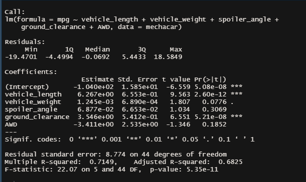
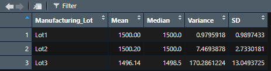

# MechaCar_Statistical_Analysis

## Linear Regression to Predict MPG

As shown from the PR(>|t|) field in the screenshot below, vehicle length at 2.6 x 10-12 and ground clearance at 5.21 x 10^-8 are statistically unlikely to provide a random amount of variance to the mpg values in the dataset. The intercept at 5.08 x 10^-8   is also considered to be statistically significant. We can also conclude from our linear regression analysis that the slope is not zero because its p-value is 5.35 x 10^-11  which is much smaller than our significance level of 0.05%. Due to this we have enough evidence to reject our null hypothesis that the slope is not zero. Our model does an adequate job of predicting mpg for MechaCars because the r-squared value at .71 accounts indicates that 71% of variability of mpg is explained using this model. There is some hesitation though due to the statistically significant intercept, which could indicate that there are other variables not included in this model that can help explain the variability for our dependent variable mpg. 

## Summary Statistics on Suspension Coils

As per the design specifications for the MechaCar, the variance for their suspension coils must not exceed 100 pounds per square inch. From reviewing the current manufacturing data on the design specifications per the below results, the manufacturing lots in total do meet this requirement at 62.29. When reviewed further specified into their individual lot groups however, Lot 3 does not pass this requirement as its variance is measured at 170.29 pounds per square inch. Lots 1 and 2 both easily pass this requirement for their suspension coil. 

## T-Tests on Suspension Coils

We completed T-Tests on the PSI across all manufacturing lots and then each of the individual lots as a subset compared to their population mean. As shown below, the p-value determined for a sample across all manufacturing lots was 0.79 which is above the significance level and therefore we cannot reject the null hypothesis, so the two means are statistically similar. For Lot One the p-value result came out to be a value of 1.568 x 10^-11 which is way below the significance level and thus the mean is not considered to be statistically similar. For Lot Two the p-value was determined to be 0.0006 which is close but below our threshold at 0.05, and the mean is not considered to be statistically similar. For Lot Three the p-value calculated to 0.16 which is above the threshold and we could not reject the null hypothesis in this case, so its mean is considered to be statistically similar. 

## Study Design: MechaCar vs Competition

One way that a study can be conducted to quantify how the MechaCar performs against the competition on the market and appeal to consumers, is by reviewing the data on its maintenance cost. By reviewing the average maintenance cost and comparing to its competitors, it can potentially show that the MechaCar is the preferred option. A statistical test that we could complete to review these findings is a ANOVA test. The null hypothesis would be that there is no difference in the mean maintenance cost between the MechaCar and its competitor, while the alternative hypothesis is that we will see the difference between the average maintenance cost between the MechaCar and its competition. The ANOVA statistical test is the preferred choice to determine this because it allows us to run tests on our product comparing directly against the competition on specific continuous data samples. In order to run this test our independent variables will need to be categorical which will be nominal for the MechaCar and its competitors, while the dependent variable needs to be numerical and continuous which are maintenance costs. 
